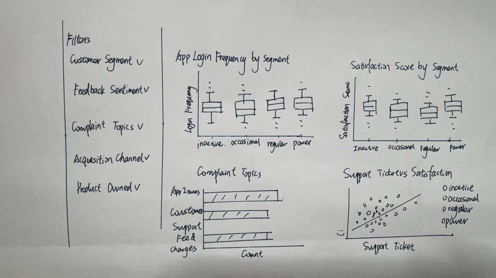

# 1 Introduction

## 1.1 Project Background

Fintech platforms generate large volumes of customer-level data related to product adoption, digital engagement, transaction behaviour, service experience, and retention outcomes. While customer structure and product ownership patterns are important starting points, fintech product and CRM teams also need to understand how customers actually interact with the platform and how they evaluate the service experience they receive.

This project develops a visual analytics dashboard for the COFINFAD Colombian fintech customer dataset. The proposed system is designed as a web-enabled Shiny application that supports interactive exploration and data-driven decision-making for business users. Rather than functioning as a collection of isolated charts, the dashboard is structured as a multi-module analytical system that moves progressively from customer overview to engagement and experience, and finally to retention and customer value.

## 1.2 Module 2 Objective

This prototype focuses on **Module 2: Customer Engagement & Experience**. The objective of this module is to analyse how customers interact with the fintech platform and evaluate their service experience.

More specifically, the module examines four connected aspects of customer behaviour and experience:

-   engagement breadth, represented by feature usage diversity and its relationship with product ownership,
-   engagement intensity, represented by app login frequency across product ownership groups,
-   experience evaluation, represented by the relationship between satisfaction and NPS,
-   and service friction, represented by complaint topic distribution and support burden.

These perspectives allow the module to move from how customers use the platform, to how they evaluate the service experience, and finally to where operational friction emerges.

# 2 Proposed Project Storyline

## 2.1 Overall Project Storyline

The proposed Shiny application follows a progressive analytical workflow:

**Customer Overview → Customer Engagement & Experience → Customer Retention & Value**

This structure allows users to move from understanding who the customers are, to examining how they use the platform and how they experience its services, and finally to identifying high-risk and high-value customer groups.

## 2.2 Role of Module 2 in the Larger System

Module 1 provides the structural foundation of the dashboard by analysing customer demographics, acquisition channels, and financial product adoption patterns. Module 3 focuses on customer retention and business value through churn analysis and predictive modelling of Customer Lifetime Value (CLV).

Module 2 sits between these two modules and acts as the behavioural and experience diagnostic layer. It extends Module 1 by examining whether product adoption is associated with broader platform usage and whether interaction patterns translate into customer advocacy. It also supports Module 3 by showing how customer satisfaction, complaints, and support burden may help explain downstream retention and value outcomes. In this way, Module 2 functions as the analytical bridge between customer structure and business outcomes.

# 3 Data Preparation Process

## 3.1 Required R Packages

The following R packages are used in this prototype module. All of them are supported on CRAN.

```{r}
pacman::p_load(
  tidyverse,
  ggplot2,
  plotly,
  scales,
  forcats,
  patchwork,
  DT,
  lubridate,
  shiny
)
```

-   `tidyverse` supports data import, wrangling, and transformation.
-   `ggplot2` is used to generate the prototype visualisations.
-   `plotly` can be used to convert static plots into interactive views for the future Shiny application.
-   `scales` helps format percentages and axes.
-   `forcats` supports categorical variable handling.
-   `patchwork` is used to combine plots during prototyping if needed.
-   `DT` supports interactive tables.
-   `lubridate` is used for date parsing and transformation.
-   `shiny` will be used later to implement the final interactive module.

These packages support data cleaning, categorical handling, grouped summaries, and the construction of prototype visualisations for engagement, experience, and service friction analysis. Some packages such as plotly, DT, and patchwork are included to support potential interactive extension, tabular display, and layout composition in the future Shiny implementation.

## 3.2 Import and Inspect the Dataset

The code chunk below is used to read the customer-level dataset into R.

```{r}
customer_data <- read_csv("data/customer_data.csv")
```

The code chunk below is used to inspect the size, structure, and variable names of the dataset.

```{r}
dim(customer_data)
glimpse(customer_data)
names(customer_data)
```

The prototype uses the customer-level dataset from COFINFAD. The separate transaction-level dataset is not used in this prototype because the customer-level table already contains sufficient aggregated behavioural and experience variables for Module 2 analysis.

## 3.3 Variable Grouping for Module 2

For this module, the variables are grouped into three analytical categories.

**Engagement variables** - `feature_usage_diversity` - `app_logins_frequency` - `bill_payment_user` - `auto_savings_enabled` - product ownership variables such as `savings_account`, `credit_card`, `personal_loan`, `investment_account`, and `insurance_product`

**Experience evaluation variables** - `satisfaction_score` - `nps_score` - `app_store_rating` - `base_satisfaction` - `tx_satisfaction` - `product_satisfaction`

**Service friction variables** - `complaint_topics` - `support_tickets_count` - `feedback_sentiment` - `resolved_tickets_ratio`

These grouped variables support the analysis of how customers use the platform, how they evaluate their experience, and where service friction emerges.

## 3.4 Data Cleaning and Transformation

The code chunk below prepares the variables required for customer engagement and experience analysis.

```{r}
customer_m2 <- customer_data %>%
  mutate(
    last_survey_date = lubridate::ymd(last_survey_date),

    customer_segment = factor(
      customer_segment,
      levels = c("inactive", "occasional", "regular", "power")
    ),

    acquisition_channel = as.factor(acquisition_channel),

    feedback_sentiment = factor(
      feedback_sentiment,
      levels = c("Negative", "Neutral", "Positive")
    ),

    complaint_topics = if_else(
      is.na(complaint_topics),
      "None",
      complaint_topics
    ),
    complaint_topics = as.factor(complaint_topics),

    support_ticket_bucket = case_when(
      support_tickets_count == 0 ~ "0",
      support_tickets_count == 1 ~ "1",
      support_tickets_count == 2 ~ "2",
      support_tickets_count >= 3 ~ "3+",
      TRUE ~ NA_character_
    ),
    support_ticket_bucket = factor(
      support_ticket_bucket,
      levels = c("0", "1", "2", "3+")
    ),

    feature_usage_bucket = case_when(
      feature_usage_diversity <= 1 ~ "0-1",
      feature_usage_diversity == 2 ~ "2",
      feature_usage_diversity == 3 ~ "3",
      feature_usage_diversity >= 4 ~ "4+",
      TRUE ~ NA_character_
    ),
    feature_usage_bucket = factor(
      feature_usage_bucket,
      levels = c("0-1", "2", "3", "4+")
    )
  )
```

The shared project-level cleaning logic also includes auditing duplicate or overlapping fields, validating range consistency, and checking cross-field consistency. In this module, special attention is given to complaint-related missing values because they directly affect the interpretation of service issue patterns. In addition, support ticket counts and feature usage diversity are grouped into diagnostic buckets to support clearer comparison in the prototype visualisations.

## 3.5 Validation of Key Variables

The code chunk below is used to inspect summary statistics for the main variables used in this module.

```{r}
customer_m2 %>%
  select(
    feature_usage_diversity,
    support_tickets_count,
    satisfaction_score,
    nps_score,
    resolved_tickets_ratio,
    app_store_rating
  ) %>%
  summary()
```

The code chunk below is used to inspect the distributions of selected categorical variables.

```{r}
customer_m2 %>%
  count(feedback_sentiment, sort = TRUE)

customer_m2 %>%
  count(complaint_topics, sort = TRUE)

customer_m2 %>%
  count(support_ticket_bucket, sort = TRUE)
```

The code chunk below is used to check the ranges of selected numeric variables.

```{r}
customer_m2 %>%
  summarise(
    min_feature_diversity = min(feature_usage_diversity, na.rm = TRUE),
    max_feature_diversity = max(feature_usage_diversity, na.rm = TRUE),
    min_tickets = min(support_tickets_count, na.rm = TRUE),
    max_tickets = max(support_tickets_count, na.rm = TRUE),
    min_sat = min(satisfaction_score, na.rm = TRUE),
    max_sat = max(satisfaction_score, na.rm = TRUE),
    min_nps = min(nps_score, na.rm = TRUE),
    max_nps = max(nps_score, na.rm = TRUE)
  )
```

These checks help ensure that the selected variables are suitable for prototype visualisation and that the key engagement, experience, and service friction indicators are in usable ranges for grouped comparison.

# 4 Selection of Visualisation Techniques

## 4.1 Average Feature Usage Diversity by Product Ownership

A grouped bar chart is used to compare average feature usage diversity across product ownership conditions. This chart is suitable because product ownership is a binary status, and the objective is to compare average engagement breadth between customers who own and do not own each product type.

## 4.2 Average App Login Frequency by Product Ownership

A grouped bar chart is used to compare average app login frequency across product ownership conditions. This chart extends the engagement analysis from usage breadth to usage intensity and helps evaluate whether customers who own different financial products also log into the platform more frequently.

## 4.3 NPS Score by Satisfaction Score

A boxplot is used to compare NPS score distributions across satisfaction score levels. This is appropriate because `nps_score` is a continuous outcome variable, while `satisfaction_score` is a discrete rating category. The chart evaluates whether higher satisfaction translates into stronger customer advocacy.

## 4.4 NPS Score by Feature Usage Diversity Bucket

A boxplot is used to compare NPS score distributions across grouped feature usage levels. This chart provides a direct bridge between platform interaction and service experience by showing whether broader platform usage is associated with stronger customer advocacy.

## 4.5 Complaint Topics Distribution

A bar chart is used to visualise complaint topic frequencies because complaint topics are categorical issue types. By excluding customers without recorded complaints, the chart focuses on the actual composition of service issues.

## 4.6 NPS Score by Support Ticket Bucket

A boxplot is used to compare NPS score distributions across grouped support ticket levels. Grouping support burden into buckets improves interpretability and helps assess whether heavier service burden is associated with weaker customer advocacy.

# 5 Visualisation Design and Interaction Principles

## 5.1 Readability and Comparability

The prototype prioritises simple chart forms, clear axis labels, and limited visual clutter. Grouped bar charts are used where average comparisons are needed, while boxplots are used to compare distributions across discrete categories. This supports readability and makes the interpretation of behavioural and experience differences more straightforward.

## 5.2 Progressive Diagnostic Flow

The visualisations are organised into a progressive diagnostic sequence:

-   product ownership and platform usage,
-   usage and experience relationships,
-   and service friction.

This flow reflects the objective of the module by moving from how customers interact with the platform, to how they evaluate the service experience, and finally to where operational friction may emerge.

## 5.3 Chart-Type Suitability

Chart types are selected according to variable structure and analytical purpose. Grouped bar charts are used for average comparisons under binary product ownership conditions. Boxplots are used for grouped comparisons involving NPS distributions. Bar charts are used for complaint frequencies because they clearly display issue composition across categories.

## 5.4 Coordinated Views for Future Shiny Use

Although this prototype is not yet a full Shiny application, the visualisations are designed to support future coordinated filtering and drill-down. Users will later be able to explore how engagement and experience vary across product ownership groups, customer segments, acquisition channels, complaint types, and support burden through shared sidebar controls.

# 6 Proposed UI Design

## 6.1 Proposed Inputs

The future Shiny module will expose the following input controls:

-   `customer_segment`
-   `acquisition_channel`
-   `feedback_sentiment`
-   `complaint_topics`
-   `product ownership`
-   `support_ticket_bucket`
-   `feature_usage_bucket`

These parameters allow users to investigate whether customer engagement, service experience, and friction vary across different customer subgroups.

## 6.2 Proposed Outputs

The module will display the following analytical outputs:

-   average feature usage diversity by product ownership
-   average app login frequency by product ownership
-   NPS score by satisfaction score
-   NPS score by feature usage diversity bucket
-   complaint topics distribution
-   NPS score by support ticket bucket
-   KPI summary cards
-   product-level engagement summary table
-   product-level login summary table

Together, these outputs help users understand how customers use the platform, how interaction connects to service experience, and where operational friction may influence customer advocacy.

## 6.3 Proposed UI Components and Layout

The proposed Shiny UI follows a sidebar–main panel layout.

**Sidebar filters** - `selectInput()` for customer segment - `selectInput()` for acquisition channel - `selectInput()` for feedback sentiment - `selectInput()` for complaint topics - `checkboxGroupInput()` for product ownership - `selectInput()` for support ticket bucket - `selectInput()` for feature usage bucket

**Main panel** - Top section: KPI cards for average satisfaction, average NPS, average support tickets, and average feature usage diversity - Middle section: product-related engagement views and experience evaluation views, including feature usage diversity, login frequency, and NPS by satisfaction - Bottom section: diagnostic views for interaction–advocacy linkage and service friction, including NPS by feature usage bucket, complaint composition, and NPS by support ticket bucket

This layout supports interactive exploration of customer engagement, customer advocacy, and service friction, while maintaining logical continuity with Module 1 and Module 3.

## 6.4 Early UI Storyboard Sketch

The figure below shows an early storyboard sketch for Module 2. It was used during the initial design stage to think through the overall sidebar–main panel layout, including the placement of filters and the arrangement of engagement and experience views.



Although the specific charts in the final prototype were later refined based on the actual data patterns, this sketch remained useful as an initial reference for the module layout. In particular, it supported the decision to organise the module into a filter sidebar, a set of summary indicators at the top, and multiple diagnostic visual views in the main panel.

# 7 Prototype Visualisations

## 7.1 Average Feature Usage Diversity by Product Ownership

The code chunk below is used to compare average feature usage diversity across product ownership groups.

```{r}
product_engagement_summary <- customer_m2 %>%
  select(
    feature_usage_diversity,
    savings_account,
    credit_card,
    personal_loan,
    investment_account,
    insurance_product
  ) %>%
  pivot_longer(
    cols = c(
      savings_account,
      credit_card,
      personal_loan,
      investment_account,
      insurance_product
    ),
    names_to = "product_type",
    values_to = "owned"
  ) %>%
  mutate(
    product_type = recode(
      product_type,
      savings_account = "Savings Account",
      credit_card = "Credit Card",
      personal_loan = "Personal Loan",
      investment_account = "Investment Account",
      insurance_product = "Insurance Product"
    ),
    ownership_status = if_else(owned, "Own", "Not Own")
  ) %>%
  group_by(product_type, ownership_status) %>%
  summarise(
    avg_feature_diversity = mean(feature_usage_diversity, na.rm = TRUE),
    .groups = "drop"
  )

p1 <- ggplot(
  product_engagement_summary,
  aes(
    x = product_type,
    y = avg_feature_diversity,
    fill = ownership_status
  )
) +
  geom_col(position = "dodge") +
  labs(
    title = "Average Feature Usage Diversity by Product Ownership",
    x = "Product Type",
    y = "Average Feature Usage Diversity",
    fill = "Ownership Status"
  ) +
  theme_minimal() +
  theme(axis.text.x = element_text(angle = 20, hjust = 1))

p1
```

This visualisation shows that product ownership is strongly associated with broader platform usage. Across all five product types, customers who own the product consistently exhibit higher average feature usage diversity than those who do not. The largest differences appear for savings accounts, credit cards, investment accounts, and personal loans. This suggests that product adoption is not only a structural characteristic of the customer base, but also an important behavioural signal of deeper platform engagement.

## 7.2 Average App Login Frequency by Product Ownership

The code chunk below is used to compare average app login frequency across product ownership groups.

```{r}
product_login_summary <- customer_m2 %>%
  select(
    app_logins_frequency,
    savings_account,
    credit_card,
    personal_loan,
    investment_account,
    insurance_product
  ) %>%
  pivot_longer(
    cols = c(
      savings_account,
      credit_card,
      personal_loan,
      investment_account,
      insurance_product
    ),
    names_to = "product_type",
    values_to = "owned"
  ) %>%
  mutate(
    product_type = recode(
      product_type,
      savings_account = "Savings Account",
      credit_card = "Credit Card",
      personal_loan = "Personal Loan",
      investment_account = "Investment Account",
      insurance_product = "Insurance Product"
    ),
    ownership_status = if_else(owned, "Own", "Not Own")
  ) %>%
  group_by(product_type, ownership_status) %>%
  summarise(
    avg_logins = mean(app_logins_frequency, na.rm = TRUE),
    .groups = "drop"
  )

p2 <- ggplot(
  product_login_summary,
  aes(
    x = product_type,
    y = avg_logins,
    fill = ownership_status
  )
) +
  geom_col(position = "dodge") +
  labs(
    title = "Average App Login Frequency by Product Ownership",
    x = "Product Type",
    y = "Average App Login Frequency",
    fill = "Ownership Status"
  ) +
  theme_minimal() +
  theme(axis.text.x = element_text(angle = 20, hjust = 1))

p2

```

This visualisation extends the engagement analysis from usage breadth to usage intensity. However, unlike feature usage diversity, average app login frequency appears almost identical between product owners and non-owners across all product categories. This suggests that login frequency is not a strong differentiator of customer engagement in the current dataset, and that breadth of feature use may be more informative than simple access frequency.

## 7.3 NPS Score by Satisfaction Score

The code chunk below is used to compare NPS score distributions across satisfaction score levels.

```{r}
p3 <- ggplot(
  customer_m2 %>%
    mutate(satisfaction_score = factor(satisfaction_score)),
  aes(
    x = satisfaction_score,
    y = nps_score,
    fill = satisfaction_score
  )
) +
  geom_boxplot(alpha = 0.8, outlier.alpha = 0.2) +
  labs(
    title = "NPS Score by Satisfaction Score",
    x = "Satisfaction Score",
    y = "NPS Score"
  ) +
  theme_minimal() +
  theme(legend.position = "none")

p3
```

This visualisation shows a strong positive relationship between customer satisfaction and NPS. As satisfaction scores increase from 2 to 6, the distribution of NPS shifts upward substantially, moving from strongly negative values toward neutral or positive levels. This indicates that customer satisfaction is closely linked to customer advocacy in the current dataset and provides one of the clearest evaluations of service experience in this module.

## 7.4 NPS Score by Feature Usage Diversity Bucket

The code chunk below is used to compare NPS score distributions across grouped feature usage levels.

```{r}
p4 <- ggplot(
  customer_m2,
  aes(
    x = feature_usage_bucket,
    y = nps_score,
    fill = feature_usage_bucket
  )
) +
  geom_boxplot(alpha = 0.8, outlier.alpha = 0.2) +
  labs(
    title = "NPS Score by Feature Usage Diversity Bucket",
    x = "Feature Usage Diversity Bucket",
    y = "NPS Score"
  ) +
  theme_minimal() +
  theme(legend.position = "none")

p4
```

This visualisation connects platform interaction with customer advocacy by comparing NPS across grouped levels of feature usage diversity. The distributions suggest a modest upward tendency in NPS as feature usage breadth increases, but the separation across groups is not strong. This indicates that broader feature usage may be associated with slightly stronger advocacy, although it is not as powerful a driver as satisfaction itself.

## 7.5 Complaint Topics Distribution (Excluding “None”)

The code chunk below is used to visualise complaint topic frequencies among customers with recorded complaints only.

```{r}
complaint_summary_actual <- customer_m2 %>%
  filter(complaint_topics != "None") %>%
  count(complaint_topics, sort = TRUE)

p5 <- ggplot(
  complaint_summary_actual,
  aes(
    x = fct_reorder(complaint_topics, n),
    y = n
  )
) +
  geom_col() +
  coord_flip() +
  labs(
    title = "Complaint Topics Distribution (Excluding 'None')",
    x = "Complaint Topic",
    y = "Number of Customers"
  ) +
  theme_minimal()

p5
```

In the data preparation process, missing complaint records were recoded as “None”. To understand the actual composition of service issues, this visualisation focuses only on customers with recorded complaints. The results show that complaint frequencies are relatively evenly distributed across customer service, fees, transaction issues, account security, and app performance. This suggests that service friction is spread across multiple dimensions of the platform rather than concentrated in one dominant issue category.

## 7.6 NPS Score by Support Ticket Bucket

The code chunk below is used to compare NPS score distributions across grouped support ticket levels.

```{r}
p6 <- ggplot(
  customer_m2,
  aes(
    x = support_ticket_bucket,
    y = nps_score,
    fill = support_ticket_bucket
  )
) +
  geom_boxplot(alpha = 0.8, outlier.alpha = 0.2) +
  labs(
    title = "NPS Score by Support Ticket Bucket",
    x = "Support Ticket Bucket",
    y = "NPS Score"
  ) +
  theme_minimal() +
  theme(legend.position = "none")

p6
```

This visualisation examines whether heavier support burden is associated with weaker customer advocacy. The NPS distributions remain broadly similar across grouped support ticket levels, with only a modest tendency toward weaker advocacy among customers with higher support burden. This suggests that support needs may reflect some degree of service friction, but they are not the strongest driver of customer advocacy in the current dataset.

## 7.7 Prototype KPI Summary

The code chunk below is used to compute summary indicators for the module.

```{r}
kpi_summary <- customer_m2 %>%
  summarise(
    avg_satisfaction = mean(satisfaction_score, na.rm = TRUE),
    avg_nps = mean(nps_score, na.rm = TRUE),
    avg_support_tickets = mean(support_tickets_count, na.rm = TRUE),
    avg_feature_diversity = mean(feature_usage_diversity, na.rm = TRUE)
  )

kpi_summary
```

The KPI summary provides an overall view of engagement and service experience in the platform. Average satisfaction is 4.16, indicating a generally moderate-to-positive experience. However, average NPS is -26.8, suggesting that customers are not strong promoters despite relatively acceptable satisfaction levels. Average support ticket volume is approximately 1 per customer, while average feature usage diversity is only 2.37, implying that most customers use a limited number of platform functions.

## 7.8 Product-level Engagement Summary

The code chunk below is used to summarise feature usage diversity by product ownership.

```{r}
product_engagement_summary
```

This table reinforces the main finding from the engagement chart by quantifying the difference in feature usage diversity between product owners and non-owners. For every product category, customers who own the product show substantially higher average feature usage diversity. This confirms that product ownership is closely associated with deeper platform interaction and provides a useful bridge from Module 1 product adoption patterns to Module 2 engagement behaviour analysis.

## 7.9 Product-level Login Summary

The code chunk below is used to summarise app login frequency by product ownership.

```{r}
product_login_summary
```

This table supports the interpretation of application usage intensity by showing that average login frequency is nearly identical across product ownership conditions. Unlike feature usage diversity, app login frequency does not appear to vary meaningfully between product owners and non-owners. This suggests that login frequency is a relatively weak indicator of differentiated customer engagement in the current dataset.

# 8 Conclusion

This prototype demonstrates how Module 2 of the proposed visual analytics dashboard can be used to examine customer engagement and service experience in a more complete and diagnostic way.

The analysis reveals four main findings. First, product ownership is strongly associated with broader platform usage. Customers who own financial products consistently use a wider range of platform features than those who do not, indicating that product adoption is closely linked to deeper engagement behaviour. Second, customer satisfaction is strongly associated with customer advocacy. As satisfaction scores increase, NPS shifts upward substantially, showing that service experience quality is closely connected to willingness to recommend the platform. Third, service friction is distributed across multiple complaint categories rather than concentrated in one dominant issue type. Fourth, the prototype also shows that not all engagement indicators are equally informative: feature usage breadth is more useful than app login frequency, while both support burden and feature usage breadth show only modest relationships with NPS compared with the much stronger effect of satisfaction.

Taken together, these findings position Module 2 as the behavioural and experience bridge between customer structure and downstream customer value analysis. The module shows that product adoption helps explain interaction breadth, that satisfaction is a key driver of advocacy, and that service friction emerges across multiple operational areas. At the same time, the prototype also reveals that some commonly assumed engagement indicators, such as login frequency, are less informative than broader feature usage. As part of the full Shiny application, this module can help fintech product and CRM teams better understand which behavioural and experience factors are most relevant before moving into retention risk and customer value analysis in Module 3.
